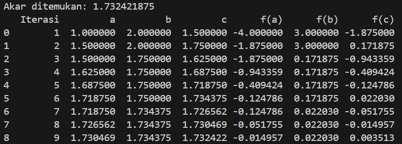

# Praktikum Komputasi Numerik

> **Nama anggota**
>
> 1. Muhammad Rifqi Ma'ruf | 5025221060
> 2. Delai Resgista Setyawan | 5025221221
> 3. Muhammad Fayyadh Rahinda | 5025221224

## Permasalahan

Implementasikan algorimta pemrosesan metode Bolzano menjadi sebuah program komputer metode Bolzano yang dapat menampilkan proses iteratif numerik, lengkap dengan grafik fungsinya.

## Metode Bisection (Metode Bolzano)

Metode Bolzano atau juga disebut sebagai Metode Bisection, adalah teknik numerik untuk mencari akar dari suatu fungsi yang kontinu. Bekerja berdasarkan Teorema Nilai Rata-Rata (Intermediate Value Theorem) yang menyatakan bahwa jika fungsi kontinu f(x) memiliki tanda yang beralawanan di dua titik `a` dan titik `b` (misalnya `f(x)` positif dan `f(x)` negatif), maka terdapat setidaknya satu titik `c` diantara `a` dan `b` dimana `f(c) = 0`.

## Algoritma

1. **Inisialisasi**: Pilih dua titik `a` dan `b` sedemikain rupa sehingga `f(a)` dan `f(b)` memiliki tanda yang berlawanan (`f(a) * f(b) < 0`).

2. **Iterasi**:

-   Hitung titik tengah tengah `c` dan `a` dan `b`:
    $$ c = \frac{a + b}{2} $$
-   Evaluasi fungsi di titik `c`: `f(c)`.
    Tentukan subinterval baru:
    -   Jika `f(c) = 0`, maka `c` adalah akar yang dicari.
    -   Jika `f(a) * f(c) < 0`, maka akar terletak di interval `[a, c]` Tetapkan `b = c`.
    -   Jika `f(b) * f(c) < 0`, maka akar terletak di interval `[c, b]`. Tetapkan `a = c`.

3. **Kondisi Berhenti**: Ulangi proses iterasi sampai panjang interval `[a, b]` menjadi sangat kecil (kurang dari toleransi yang ditentukan) atau sampai nilai absolut dari `f(c)` sangat kecil (mendekati nol).

## Hasil Proses Iterasi dan Grafik Fungsi

## Refrensi

-   PPT Komputasi Numerik Pertemuan II
-   [Github Repo](https://github.com/AfiqHaidar/bolzano-method)
-   Chat with GPT-4o (5 Juli 2024, 5:15 PM)
